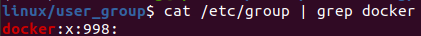
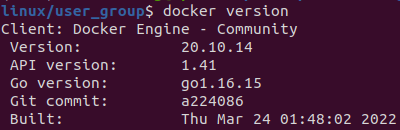

# create a docker group for convenience
1. create a group name docker
```
sudo groupadd docker
```
if there exists docker group:



2. add current user to docker group
```
sudo gpasswd -a $USER docker
```

update group:

```
newgrp docker
```
3. test
```
docker version
```

